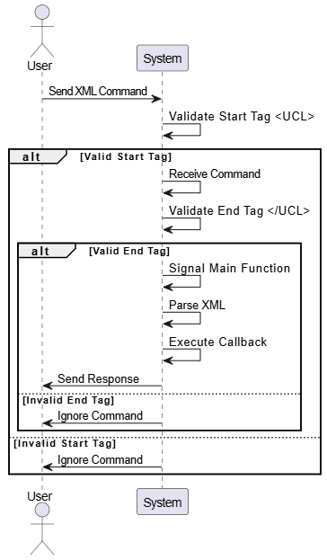

# Interactive Command Line

## Overview
This project demonstrates the design and development of an embedded system using the STM32F103C8T6 microcontroller, which features an ARM Cortex-M3 core. The system is designed to:
- Receive commands through a serial port in XML format.
- Validate the XML structure.
- Parse the commands and execute the corresponding callback functions.
- Respond to commands appropriately.

This project highlights coding practices and provides a foundation for future embedded development projects.

## Features
- **XML Command Handling:** Processes commands in the XML format (e.g., `<UCL><CMD>LightOn</CMD><PARAM>10</PARAM></UCL>`).
- **Robust Validation:** Validates both the start (`<UCL>`) and end (`</UCL>`) parent tags to ensure data integrity.
- **Timeout Handling:** Ignores incomplete commands if the end tag (`</UCL>`) is not received within a predefined limit.
- **Semaphore Signaling:** Utilizes a binary semaphore to signal the main function for parsing and executing commands.
- **Callback Execution:** Calls relevant functions based on the parsed command.
- **Custom Memory Pool:** Designed a safe and efficient memory pool for dynamic memory allocation. This approach avoids the use of standard C libraries for memory management, reducing the risk of memory fragmentation, improving allocation performance, and ensuring predictable behavior in an embedded environment.

## Workflow
1. **Command Reception:**
   - The system continuously monitors the serial port for incoming data.
   - It checks for the start parent tag `<UCL>`.
   - If the start tag is correct, it continues to receive the rest of the string.
   - If the start tag is invalid, the system ignores the input string.

2. **Validation:**
   - The system constantly checks for the end parent tag `</UCL>`.
   - If the end tag is not received before reaching the input string limit, the command is ignored.

3. **Command Execution:**
   - Once a valid command is received, the system signals the main function using a binary semaphore.
   - The main function parses the XML, identifies the command, and calls the relevant callback function.
   - The system generates an appropriate response.

## UML Sequence Diagram


## Example Command
Input command:
```xml
<UCL><CMD>LightOn</CMD><PARAM>10</PARAM></UCL>
```
- **Start Tag:** `<UCL>`
- **Command:** `<CMD>LightOn</CMD>`
- **Parameter:** `<PARAM>10</PARAM>`
- **End Tag:** `</UCL>`

## Getting Started
### Prerequisites
- STM32F103C8T6 microcontroller
- UART interface for serial communication
- Development environment:
  - KEIL IDE (used for developing this project)
  - ARM GCC Compiler or equivalent (optional)

### Building and Flashing
1. Clone the repository:
   ```bash
   git clone https://github.com/<your-username>/<repository-name>.git
   ```
2. Open the project in KEIL IDE and build it.
3. Flash the firmware to the STM32F103C8T6 microcontroller.

### Testing
1. Connect the STM32F103C8T6 to a serial terminal via UART.
2. Send commands in XML format to the microcontroller.
3. Observe the responses to ensure correct operation.

---
Thank you for exploring this project! Your feedback is greatly appreciated.

